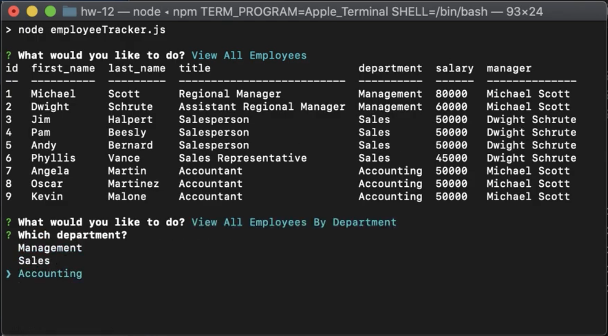

# Homework 12: Employee Tracker (MySQL)

## Description
This application is a command-line interface that accesses an SQL database and allows the user to view, add, update, and remove from it. 

## Demo Video
<a href="https://youtu.be/eUcwLyTHx8k">Demo</a>

## Credits
* Javascript
* Node.js
* Inquirer
* MySQL
* console.table

## Contact
* kdoh52@gmail.com
